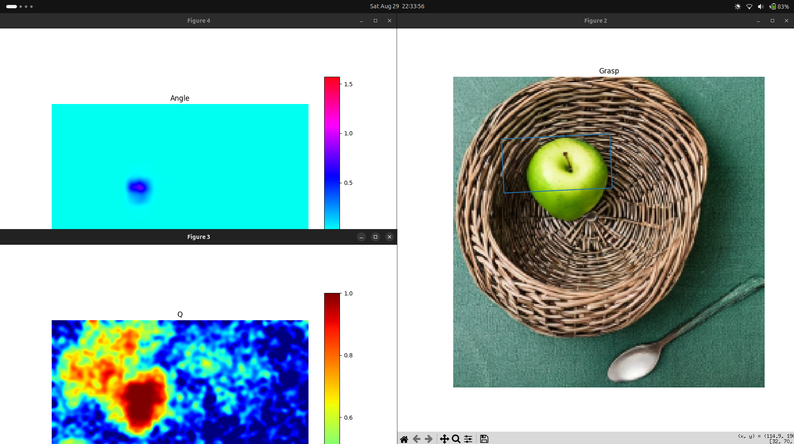
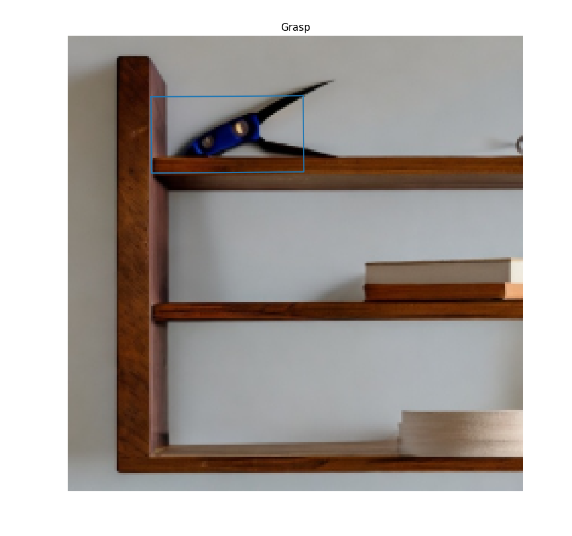
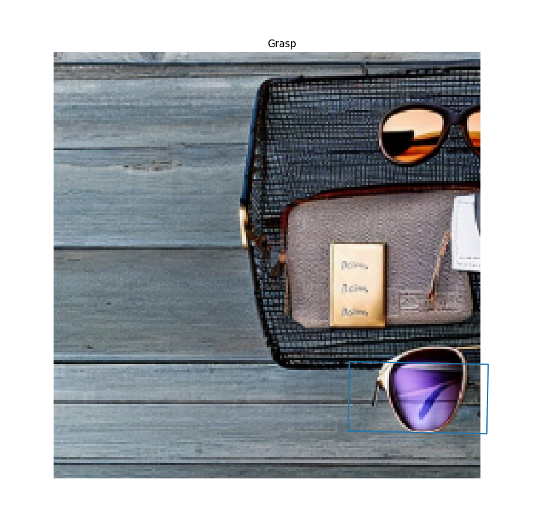

# LGD Reimplementation

From-scratch reimplementation of "Language-driven Grasp Detection"
(Vuong et al., CVPR 2024) — arXiv:2406.09489.

Goal: understand every component from first principles, not to re-run released code.

## Layout
- `derivations/` — math worked by hand (Modules 0-6)
- `notes/`       — findings, paper-vs-code discrepancies
- `src/`         — the reimplementation
- `experiments/` — runs and results

## Status
- [x] Environment (Python 3.9, torch 1.12.1+cpu)
- [x] Dataset downloaded (Grasp-Anything + ++, ~73 GB)
- [ ] Module 0-6 derivations
- [ ] Data pipeline
- [ ] Diffusion core
- [ ] Network
- [ ] Losses
- [ ] Eval harness
- [ ] Training (needs GPU)

## Key references
- Paper: arXiv:2406.09489
- Released code: github.com/Fsoft-AIC/LGD
- Dataset: huggingface.co/datasets/airvlab/Grasp-Anything{,-pp}

---

## Qualitative results (released checkpoint)

Predicted grasp rectangles from \`lgd_pretrained.pth\`, evaluated on real Grasp-Anything++ test images via the corrected reference pipeline (see [\`docs/setup.md\`](docs/setup.md) §4-5 for the CPU fixes required to get this running).

| | | |
|---|---|---|
|  |  |  |

The scissors result is notable — the predicted box lands on the handle, avoiding the blades entirely, a genuinely safety-aware grasp choice.

Quantitative baseline: 187/505 = 37.0% (95% CI ~[33%, 41%]) on seen-test, released checkpoint. Paper reports 0.48. See notes/paper_vs_code.md.
